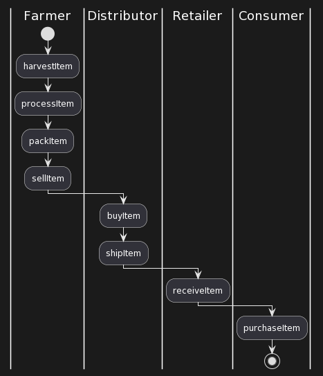
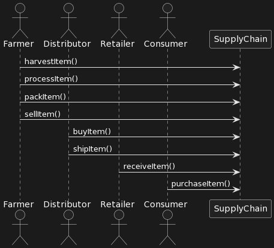
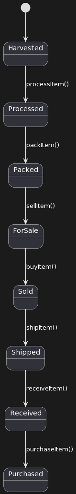

# Blockchain Supply Chain Solution

This project aims to create a secure and transparent supply chain solution for the coffee industry using the Ethereum (Sepolia) blockchain. The solution allows tracking of coffee products from the farmer to the end consumer, ensuring product quality and fair trade practices. To visualize the functioning of our solution, we've created Unified Modeling Language (UML) diagrams, that can be found in the 'images' folder.

The solution is built using Solidity (version 0.8.1), along with the Web3.js library (version v1.8.2) to interact with the Ethereum (Sepolia) blockchain. Its structure and flow have been depicted using UML diagrams. The contract has been deployed to the Ethereum (Sepolia) network and can be interacted with at the contract address: `0xF153e41a5ac170C4437749EB4804BD9D6bEbbB64`.

The development environment for this project consists of Truffle v5.7.7 (core: 5.7.7) and Node v16.9.1 which have been used for compiling and migrating the smart contracts as well as running tests and interact with the deployed contracts.

*Activity Diagram: shows the transitions and decisions in the process.*

*Sequence Diagram: helps to visualize how processes operate with one another and in what order.*

*State Diagram: demonstrates the behavior of an object, which can be in multiple states, throughout its life cycle.*

.png)
*Class Diagram: displays the system's static structure, providing a clear picture of the interacting entities within it.*

## Project Files
The solution is divided into the following files:

- **SupplyChain.sol**: This file contains the main contract that combines all other components and defines the logic for tracking coffee products. It manages the different stages of the supply chain, from harvesting to purchase by the consumer.
- **Ownable.sol**: This file contains functions that establish the contract owner and provide functionality for transferring ownership. It ensures that only the owner can perform certain privileged operations, such as adding new roles.
- **ConsumerRole.sol**: This file contains functions that manage the consumer role, defining access control for consumers in the supply chain.
- **RetailerRole.sol**: This file contains functions that manage the retailer role, defining access control for retailers in the supply chain.
- **DistributorRole.sol**: This file contains functions that manage the distributor role, defining access control for distributors in the supply chain.

Web3.js (version v1.8.2) has been instrumental in enabling the solution to interact with the Ethereum (Sepolia) blockchain. This library allows our application to send transactions, interact with smart contracts, and access blockchain data directly from JavaScript.

jQuery has been used to simplify the DOM manipulation, event handling, and AJAX interactions in the frontend part of the project. This enables a seamless and interactive user experience, allowing users to track the supply chain process in real-time.

Truffle Contract has been used to simplify working with smart contracts. It provides a more convenient and flexible way to interact with our contracts, including automatic contract abstractions, function return value decoding, and transaction simulating calls. The Truffle version used in this project is v5.7.7 (core: 5.7.7).

## Setting Up the DApp

Start the application by running the DApp on a server. The DApp initialization process will begin as soon as the window loads. This includes initializing Web3, reading form data, setting up blockchain access, fetching the user's Metamask account, initializing the supply chain, and binding click events to buttons.

## Interacting with the DApp

Farmer's Role:
1. As a farmer, fill the fields in the form with relevant data such as SKU, UPC, your Metamask Account ID, Farm Name, Farm Information, Farm Latitude, Farm Longitude, and Product Notes.
2. Once you have filled out all the necessary data, find the button associated with the harvestItem function (This button will likely be labeled 'Harvest' or something similar) and click on it to register the harvested item.
3. Similarly, find the button associated with the processItem function and click on it to mark the item as processed.
4. Click the button associated with the packItem function to mark the item as packed.
5. Lastly, specify the product price, then click the button associated with the sellItem function to mark the item as for sale.

Distributor's Role:
6. As a distributor, ensure the product price is correct and then click the button associated with the buyItem function to buy the item from the farmer.
7. Click the button associated with the shipItem function to ship the item to the retailer.

Retailer's Role:
8. As a retailer, receive the item from the distributor by clicking the button associated with the receiveItem function.

Consumer's Role:
9. Finally, as a consumer, you can purchase the item from the retailer by clicking the button associated with the purchaseItem function.

## Checking the Item Status
10. The status of the item in the supply chain can be checked at any time by inputting the UPC into the relevant form field and clicking the button associated with the fetchItemBufferOne and fetchItemBufferTwo functions.

## Watching Events
11. All blockchain events related to the supply chain are automatically fetched and displayed in the '#ftc-events' section of the DApp, which is updated in real-time as events occur.

## Conclusion

In conclusion, this blockchain-based supply chain solution provides a secure, transparent, and efficient method for tracking coffee products from the farmer to the end consumer. By leveraging the Ethereum (Sepolia) blockchain and smart contracts, alongside Web3.js, jQuery, and Truffle Contract libraries, it ensures product quality, fair trade practices, and accountability for all participants in the supply chain. The contract is deployed at the Ethereum (Sepolia) address `0xF153e41a5ac170C4437749EB4804BD9D6bEbbB64`, which enables users to interact with it directly on the Ethereum (Sepolia) network.
